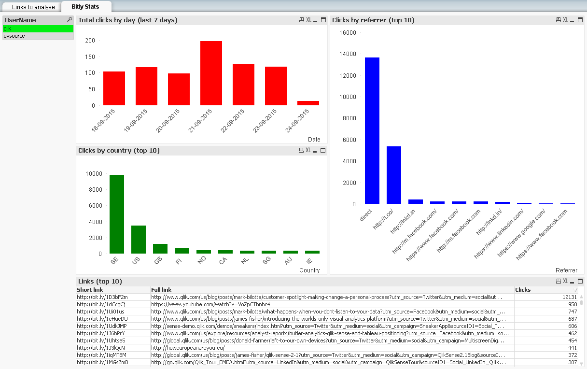

## QVSource Bitly Starter App
A template application showing how to get started using the [QVSource bitly Connector For QlikView And Qlik Sense](http://wiki.qvsource.com/bitly-Connector-for-QlikView-And-Qlik-Sense-%28v2%29.ashx).

*Note that this also uses the Twitter Connector V2 to fetch data for analysis.*

**QlikView Users**
You can simply click the ["Download ZIP"](https://github.com/QVSource/QVSource-Bitly-Starter-App/archive/master.zip) button on GitHub to grab this application.

**Qlik Sense Users**
You can use the [load script](https://github.com/QVSource/QVSource-Bitly-Starter-App/blob/master/Bitly-Starter-App-prj/LoadScript.txt) in your Qlik Sense applications.*

The content below is copied from the change log in the first tab of the load script.

Change Log
----------
0.0.8 - 24/09/15
----------------
* Initial version.
